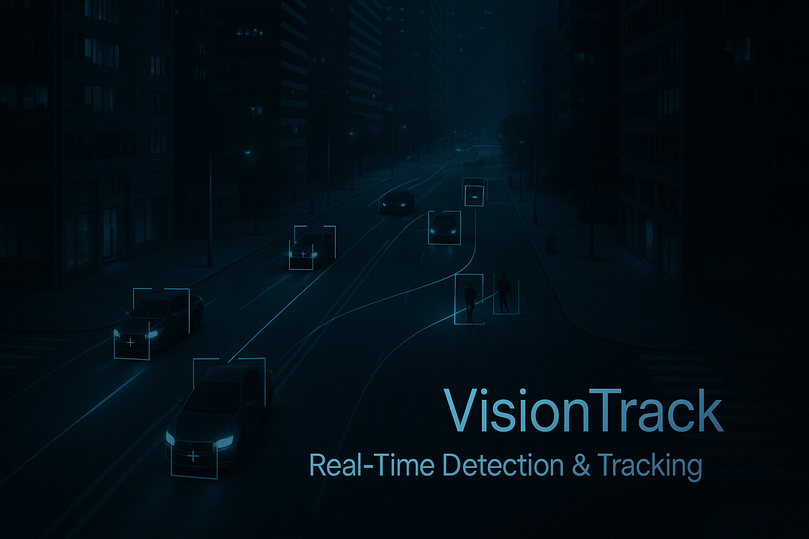

<h1 align="center">🎯 VisionTrack</h1>

<p align="center">
  
</p>

<p align="center">
  
  
  
  
</p>
<p align="center"><em>A real-time object detection and tracking system with advanced surveillance capabilities</em></p>

---

## ⚡ Quick Links

- 🚀 [Features](#features)
- 🛠️ [Prerequisites](#prerequisites)
- ⚡ [Quick Start](#quick-start)
- 🧪 [Testing](#testing)
- 📖 [Documentation](#documentation)
- 🎮 [Usage](#usage)
- 🙋‍♂️ [Contributing](#contributing)
- 📝 [License](#license)
- 🙏 [Acknowledgments](#acknowledgments)
- 📫 [Contact](#contact)

---

##  Features

- **Real-time Object Detection**
  - YOLOv8 integration for accurate detection
  - Support for multiple object classes
  - Configurable confidence thresholds

- **Advanced Tracking**
  - Multi-object Kalman filter tracking
  - Trajectory visualization
  - Velocity estimation
  - Object reidentification

- **Alert System**
  - Speed violation detection
  - Restricted area monitoring
  - Stopped vehicle detection
  - Customizable alert thresholds

- **Video Management**
  - Live video processing
  - Recording with annotations
  - Rolling storage system
  - MP4 format support

## Prerequisites

- **Development Environment**
  - C++ Compiler (MinGW-w64/MSVC)
  - CMake 3.10+
  - Git
  - OpenCV (included in repo)

- **Hardware**
  - Webcam/IP Camera
  - GPU recommended for YOLOv8

##  Quick Start

1. **Clone Repository**
```bash
git clone https://github.com/Harshitkant21/VisionTrack.git
cd VisionTrack
```

2. **Configure Project**
```bash
mkdir build && cd build
cmake -G "MinGW Makefiles" ..
```

3. **Build**
```bash
cmake --build . --config Release
```

4. **Run**
```bash
./VisionTrack.exe
```

##  Testing

### Running Tests
```bash
cd build
ctest --verbose
```

### Test Coverage
- **Detection Tests**: Input validation, model loading
- **Tracking Tests**: Object persistence, velocity calculation
- **Alert Tests**: Violation detection, alert generation
- **Config Tests**: Parameter validation

### Test Results
```bash
[==========] Running 12 tests
[----------] Global test environment set-up.
[ PASSED  ] 12 tests.
```

## Documentation

- [User Guide](docs/user_guide.md) - Detailed setup and usage instructions
- [Technical Specs](docs/tech_specs.md) - Architecture and implementation details


##  Usage

1. **Start Application**
   - Launch VisionTrack.exe
   - Select video source (webcam/file)

2. **Controls**
   - `R` - Start/Stop recording
   - `T` - Toggle trajectories
   - `V` - Toggle velocity vectors
   - `ESC` - Exit application

3. **Configuration**
   ```ini
   # config.txt
   confidence_threshold=0.25
   nms_threshold=0.45
   speed_limit=50.0
   max_recordings=5
   ```

##  Contributing

1. Fork the repository
2. Create your feature branch:
```bash
git checkout -b feature/AmazingFeature
```
3. Commit changes:
```bash
git commit -m 'Add: AmazingFeature'
```
4. Push to branch:
```bash
git push origin feature/AmazingFeature
```
5. Open a Pull Request

##  License

Distributed under the MIT License. See `LICENSE` for more information.

##  Acknowledgments

- OpenCV Team
- Ultralytics YOLOv8
- Contributors & Testers

##  Contact

Twitter - [@Harshit](https://x.com/Harshit61124884)

Project Link: [Github](https://github.com/Harshitkant21/VisionTrack)

---
<div align="center">
Made with ❤️ by VisionTrack Team
</div>